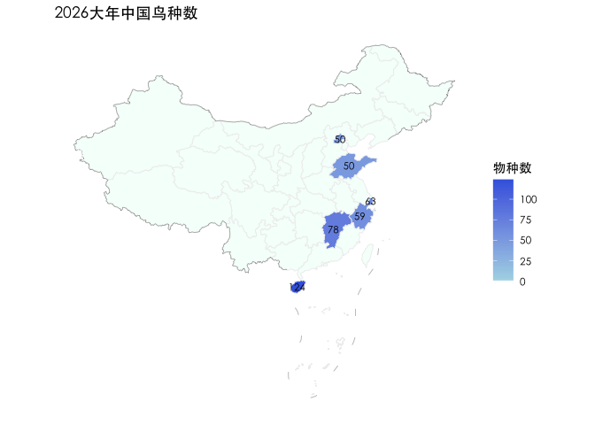

2026大年中国鸟种数
================
Jiahua

``` r
library(dplyr)
```

    ## 
    ## Attaching package: 'dplyr'

    ## The following objects are masked from 'package:stats':
    ## 
    ##     filter, lag

    ## The following objects are masked from 'package:base':
    ## 
    ##     intersect, setdiff, setequal, union

``` r
library(data.table)
```

    ## 
    ## Attaching package: 'data.table'

    ## The following objects are masked from 'package:dplyr':
    ## 
    ##     between, first, last

``` r
library(sf)
```

    ## Linking to GEOS 3.13.0, GDAL 3.8.5, PROJ 9.5.1; sf_use_s2() is TRUE

``` r
library(ggplot2)

ebird_taxonomy <- read.csv("ebird_taxonomy.csv")
df <- read.csv("MyEBirdData.csv")
map_geo <- sf::st_read("shapefile/china_map/中国省级地图GS（2019）1719号.geojson",
                       quiet = TRUE)
jdx <- sf::st_read("shapefile/china_map/九段线GS（2019）1719号.geojson",
                   quiet = TRUE)

regions <- c("CN", "HK", "MO", "TW")   # 大陆、香港、澳门、台湾
prov_dict <- c(
  "CN-11" = "北京市","CN-12" = "天津市","CN-13" = "河北省","CN-14" = "山西省","CN-15" = "内蒙古自治区",
  "CN-21" = "辽宁省","CN-22" = "吉林省","CN-23" = "黑龙江省","CN-31" = "上海市","CN-32" = "江苏省",
  "CN-33" = "浙江省","CN-34" = "安徽省","CN-35" = "福建省","CN-36" = "江西省","CN-37" = "山东省",
  "CN-41" = "河南省","CN-42" = "湖北省","CN-43" = "湖南省","CN-44" = "广东省","CN-45" = "广西壮族自治区",
  "CN-46" = "海南省","CN-50" = "重庆市","CN-51" = "四川省","CN-52" = "贵州省","CN-53" = "云南省",
  "CN-54" = "西藏自治区","CN-61" = "陕西省","CN-62" = "甘肃省","CN-63" = "青海省","CN-64" = "宁夏回族自治区",
  "CN-65" = "新疆维吾尔自治区",
  "TW" = "台湾省","HK" = "香港特别行政区","MO" = "澳门特别行政区"
)

df <- df %>% 
  mutate(Year = year(Date)) %>%
  filter(Year == 2026) %>%
  left_join(ebird_taxonomy, by = c("Scientific.Name" = "SCI_NAME")) %>%
  mutate(
    Corrected_Name = ebird_taxonomy$SCI_NAME[match(REPORT_AS, ebird_taxonomy$SPECIES_CODE)],
    Scientific.Name = if_else(!is.na(REPORT_AS) & !is.na(Corrected_Name), 
                              Corrected_Name, 
                              Scientific.Name)
  ) %>%
  select(-c(SPECIES_CODE, REPORT_AS, TAXON_ORDER, PRIMARY_COM_NAME, FAMILY,SPECIES_GROUP,TAXON_CONCEPT_ID, ORDER)) %>%
  filter(CATEGORY %in% c("domestic", "issf", "species")) %>%
  mutate(Country_code=substr(State.Province,1,2))  %>%
  mutate(State.Province = case_when(
    # ^ 表示字符串的开头
    grepl("^HK-", State.Province) ~ "HK",
    grepl("^TW-", State.Province) ~ "TW", 
    grepl("^MO-", State.Province) ~ "MO",
    # TRUE 代表“其他所有情况”，保持原值
    TRUE ~ State.Province
  )) 

df.china.record <- df %>% 
  filter(State.Province %in% names(prov_dict)) %>%
  mutate(CNAME = prov_dict[State.Province]) %>%
  group_by(CNAME) %>%
  summarise(n_species=n_distinct(Scientific.Name))

map_geo <- map_geo %>%
  left_join(df.china.record)
```

    ## Joining with `by = join_by(CNAME)`

``` r
hainan.species <- map_geo$n_species[map_geo$CNAME=="海南省"]
ggplot()+
  geom_sf(data=map_geo, aes(fill=n_species), color = "#EEEEEE",
          linewidth = 0.3)+
  geom_sf(data=jdx, linewidth = 0.1, color = "black")+
  scale_fill_gradientn(
    colours = c("white", "#ADD8E6", "#4169E1"),
    values = scales::rescale(c(0, 1, max(df.china.record$n_species)-10)),  
    limits = c(0, max(df.china.record$n_species)),
    na.value = "#F5FFFA"
  ) +
  geom_sf_text(data = map_geo,
               aes(label = n_species),
               family = "STHeiti",
               size = 3,
               color = "black") +
  coord_sf() +
  theme_minimal(base_family = "STHeiti") +
  theme(
    panel.grid.major = element_blank(),
    panel.grid.minor = element_blank(),
    axis.text = element_blank(),
    axis.title = element_blank(),
    legend.position = "right"
  )+
  labs(fill="物种数", title = "2026大年中国鸟种数")
```

    ## Warning in st_point_on_surface.sfc(sf::st_zm(x)): st_point_on_surface may not
    ## give correct results for longitude/latitude data

    ## Warning: Removed 28 rows containing missing values or values outside the scale range
    ## (`geom_text()`).

<!-- -->
